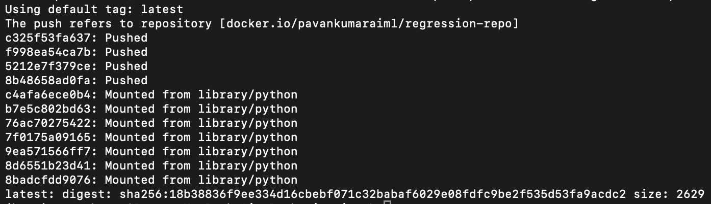
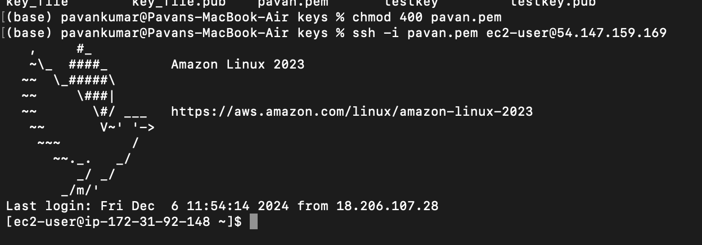
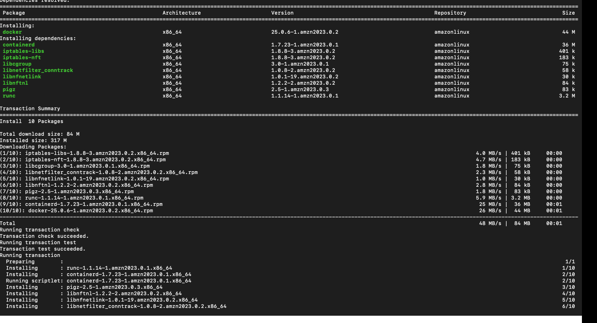

<h1> In this folder we will see how can we build a docker image and run the container in the AWS service. </h1>

- After listing all the necessary files in docker file we will create the docker image first by running the command "docker build -t myimage ." (t -> tag it , last . for the docker file in the same directory)

- run the container by using the command "docker run --name pavancontainernw -p 8000:8000 myimage"

- Follow the link for the fastapi docker https://fastapi.tiangolo.com/deployment/docker/#dockerfile

- Create the repository in docker hub.

- tag the image by "docker tag docker_image_name dockerhub_reponame"

- Now check the created image in the docker desktop. 

- Now push the tagged image dockerhub_reponame by command "docker push dockerhub_reponame"

- check the image in to the docker hub.

<h3> Now here we will see how can we deplye the container in AWS Elastic container service </h3>

- After launching the EC2 instance use public IP-Address to connect with the EC-2 instance remotly. 

<h3> To connect the instance to your local machine we use the public ip address and follow th ebelow points</h3>

- go to the directory where .pem key is saved and then activate is by command "chmod 400 kayname.pem"

- After activating the key then connect the container by typing the command in terminal  "ssh -i your-key-pair-name.pem ec2-user@your-instance-public-ip"

-  To be a root user "sudo su"

- To undate package manager "yum update -y"

- Now we will install docker in AWS.

> type command "curl -fsSL https://get.docker.com -o get-docker.sh"
> Then type " yum install docker -y" to install the docker in the remote EC2 instance. 

> To start the docker "systmectl start docker"